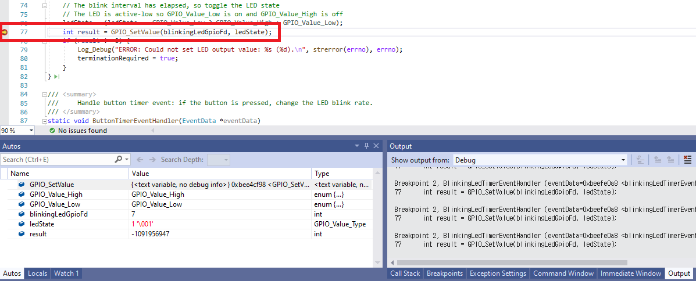

# Lab-1: GPIO 로 LED 제어하기

- [Home Page](README.md) 로 돌아가기

## 목적

- Azure Sphere High-level Applicaiton 의 기본적인 이해
- Visual Studio 를 이용해 Application 을 빌드하고 디버그하는 방법을 익힙니다.
- Azure Sphere SDK 의 GPIO API 사용방법을 익힙니다.

## 단계

1. Azure Sphere utility 에서 디바이스를 디버그 모드로 전환합니다. (OTA는 비활성화)
   
   `azsphere device prep-debug`

2. Azure Sphere 예제 Repository 를 복사합니다.

    `git clone https://github.com/Azure/azure-sphere-samples`

3. Visual Studio에서 'Open a project or solution'을 클릭합니다.   
   `.\azure-sphere-samples\Samples\GPIO\GPIO_HighLevelApp`폴더로 이동한 후,    
    GPIO_HighLevelApp.sln 을 열고, **F5** 를 누르면 빌드 후 디버깅을 위해 어플리케이션이 디바이스에 로드됩니다.
   
 
   
4. 응용 프로그램이로드 된 후 LED1이 깜박이기 시작합니다. **버튼A**
를 누르면 깜박임 속도가 변경됩니다. LED1과 버튼A는 모두 GPIO 핀에 연결되며 High-level Applicaiton 에 의해 제어됩니다.

5. 74번 라인에서 **F9** 를 눌러 *GPIO_SetValue* 함수에 브레이크포인트를 설정하면, 
프로그램이 이 라인에서 멈추는 것을 볼 수 있습니다. 다시 **F5** 를 눌러 LED ON/OFF 를 제어할 수 있습니다. 

 

## 더 보기
- [Azure Sphere의 GPIO 사용](https://docs.microsoft.com/ko-kr/azure-sphere/app-development/gpio)
- [High-level Application의 모범사례](https://docs.microsoft.com/ko-kr/azure-sphere/app-development/initialization-termination)
- [Target 하드웨어 종속성 관리](https://docs.microsoft.com/ko-kr/azure-sphere/app-development/manage-hardware-dependencies)

