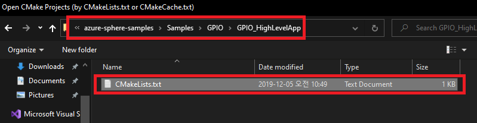
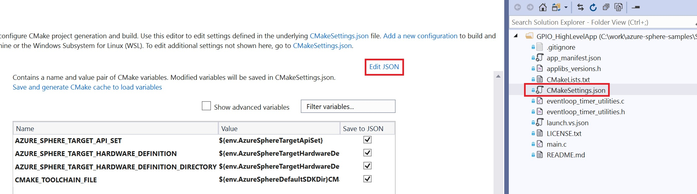
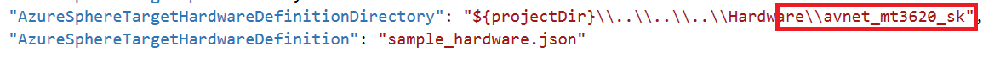
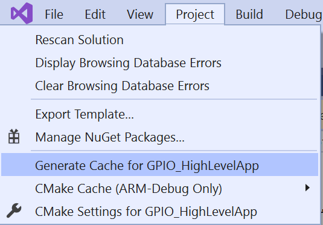
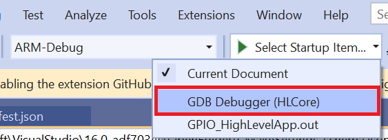
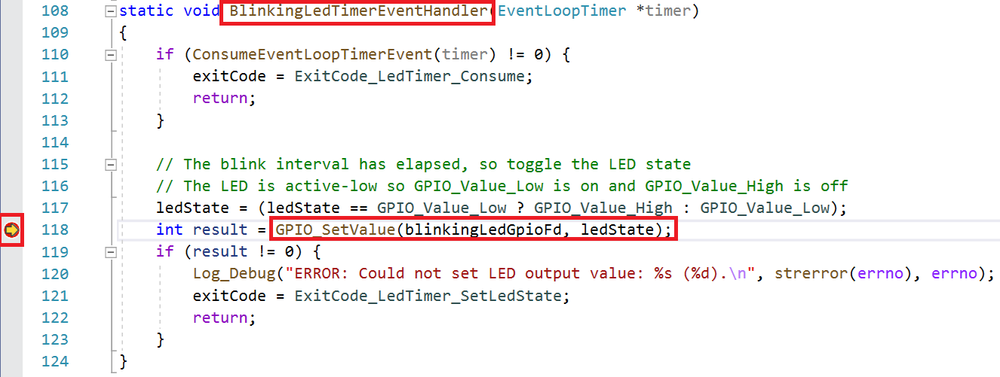
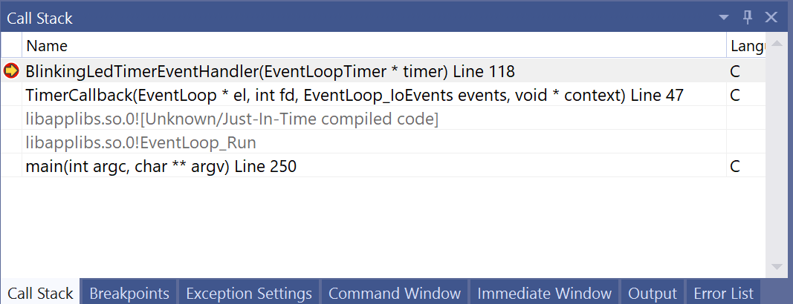
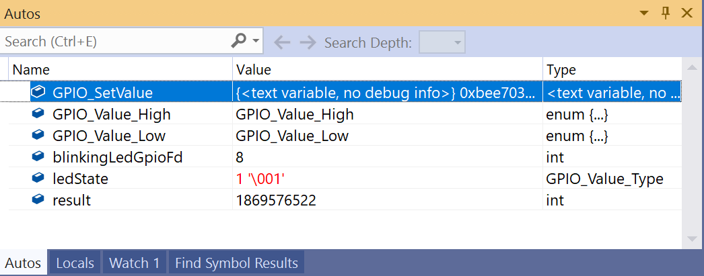

# Lab-1: GPIO 로 LED 제어하기

- [Home Page](README.md) 로 돌아가기

## 목적

- Azure Sphere High-level Applicaiton 의 기본적인 이해
- Visual Studio 를 이용해 Application 을 빌드하고 디버그하는 방법을 익힙니다.
- Azure Sphere SDK 의 GPIO API 사용방법을 익힙니다.

## 단계

1. Azure Sphere utility 에서 디바이스를 디버그 모드로 전환합니다. (OTA는 비활성화됨)
   
   `azsphere device enable-development`

2. Azure Sphere 예제 Repository 를 복사합니다.

    `git clone https://github.com/Azure/azure-sphere-samples`

3. Visual Studio 를 실행하여 `File - Open - CMake...` 를 차례로 클릭합니다.

3. `.\azure-sphere-samples\Samples\GPIO\GPIO_HighLevelApp`폴더로 이동한 후, CMakeLists.txt 를 선택합니다. 
   
 
 

5. (optional) 공식 예제 코드는 MT3620_RDB 기준으로 되어 있기 때문에, AVNET_MT3620_SK 를 사용하는 경우 추가 수정이 필요합니다. Azure Sphere OS 는 하드웨어 정의 파일을 통해 하드웨어 설정을 추상화 합니다. 이에 Solution Explorer 에서 CMakeSettings.jon 을 더블 클릭하여 Hardware Definition File 을 변경해줍니다.

*AzureSphereTargetHardwareDefinitionDirectory* 에서 mt3620_rdb 를 **avnet_mt3620_sk** 로 수정해줍니다. Ctrl+S 를 눌러 저장하면 CMake 캐쉬를 재생성합니다.
자동으로 생성되지 않을 경우 메뉴바에서 Project -> Generate Cache... 로 생성할 수 있습니다.

5. Select Start up item 을 GDB Debugger(HLCore) 선택 후 **F5** 를 누르면 빌드 후 디버깅을 위해 어플리케이션이 디바이스에 로드됩니다.

 
   
6. 응용 프로그램이 로드 된 후 LED1이 깜박이기 시작합니다. **버튼A**
를 누르면 깜박임 속도가 변경됩니다. LED1과 버튼A는 모두 GPIO 핀에 연결되며 High-level Applicaiton 에 의해 제어됩니다.

7. 118번 라인에서 **F9** 를 눌러 *GPIO_SetValue* 함수에 브레이크포인트를 설정하면, 
프로그램이 이 라인에서 멈추는 것을 볼 수 있습니다. 다시 **F5** 를 눌러 LED ON/OFF 를 제어하며 디버깅이 가능합니다.

 
 
 

## 도전

app_manifest.json 파일과 user application 을 수정하여 BLUE LED를 제어 해봅니다.

> MT3620 RDB의 경우 LED2 의 BLUE 색상은 **GPIO17**에 연결되어 있고, *SAMPLE_RGBLED_BLUE* 로 하드웨어 정의 파일에 정의되어 있습니다.

> Avnet Starter Kit의 경우 USER LED의 BLUE 색상은 **GPIO10** 에 연결되어 있고, *SAMPLE_RGBLED_BLUE* 로 하드웨어 정의 파일에 정의되어 있습니다.
 기본 하드웨어 정의 파일인 경우 *$MT3620_GPIO10* 혹은 *$MT3620_RDB_LED1_BLUE* 으로 제어할 수도 있습니다.

> 보드에 따라 하드웨어 정의파일을 Starter Kit 으로 변경하고 manifest 파일과 어플리케이션도 변경해봅니다.( **avnet_mt3620_sk** )

## 더 보기
- [Azure Sphere의 GPIO 사용](https://docs.microsoft.com/ko-kr/azure-sphere/app-development/gpio)
- [High-level Application의 모범사례](https://docs.microsoft.com/ko-kr/azure-sphere/app-development/initialization-termination)
- [Target 하드웨어 종속성 관리](https://docs.microsoft.com/ko-kr/azure-sphere/app-development/manage-hardware-dependencies)

