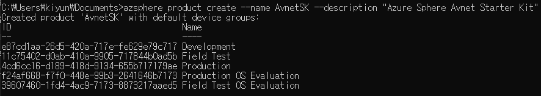
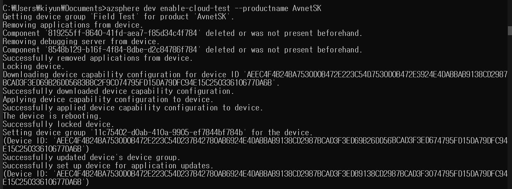
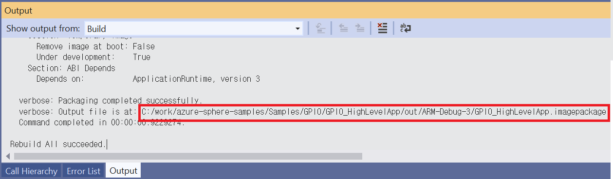
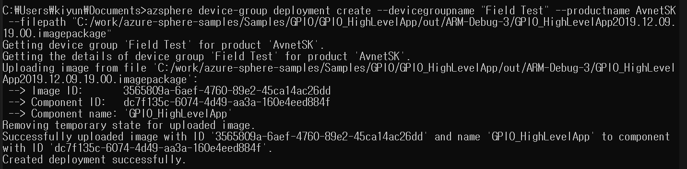
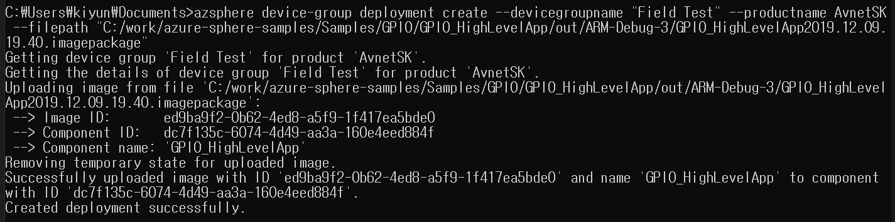

# Lab-2: Over-the-Air로 어플리케이션 배포하기

- [Home Page](README.md)로 돌아가기

## 목적

- Azure Sphere 에 Wi-Fi 네트워크 설정하는 것을 익힐 수 있습니다.
- Azure Sphere 유틸리티를 통해 어플리케이션을 Over-The-Air로 배포하는 방법을 배울 수 있습니다.
- Over-The-Air 배포를 이해하는데 필요한 모든 컨셉을 이해할 수 있습니다.
  
## 단계

1. 아래의 절차대로 Wi-Fi credential 이 설정되었는지 확인하고 Azure Sphere 를 AP에 연결합니다.

- Wi-Fi SSID 와 패스워드를 설정하고 Azure Sphere 디바이스를 Azure Sphere 보안 서비스에 연결하도록 합니다.   
   `azsphere device wifi add --ssid <yourSSID> --psk <yourNetworkKey>`
   
   > - 보안설정이 없는 Wi-Fi 네트워크 연결에서는 --psk 플래그를 생략합니다.
   > - 만약 SSID 나 패스워드에 스페이스가 있는 경우는 " "처리 합니다. e.g. --ssid "My iPhone"

-  아래의 커맨드로 AP에 연결되었는지 Wi-Fi 상태를 확인할 수 있습니다.
   
   `azsphere device wifi show-status`

    
    
2. *product* 를 추가하고 고유의 이름을 할당합니다. Description 파라메터는 옵션이므로 필수는 아닙니다.

   `azsphere product create --name <product-name> --description <optional-desc>`

   
   
3. Product 를 추가하면 기본적으로 5개의 Device group 이 생성됩니다.

    |  Device Group Name       | App Update  | OS Update | 
    |  ----------------        | ----------  | --------- | 
    | Development              | Disabled    | Retail OS |
    | Field Test               | Enabled     | Retail OS |
    | Field Test OS Evaluation | Enabled     | Retail Evaluation OS |
    | Production               | Enabled     | Retail OS |
    | Production OS Evaluation | Enabled     | Retail Evaluation OS |
    
    - Development 디바이스 그룹은 클라우드 애플리케이션 업데이트를 사용하지 않도록 설정하고 Retail OS를 제공합니다.
    
    - Field Test 는 클라우드 애플리케이션 업데이트를 사용하도록 설정하고 Retail OS를 제공합니다.

    - Production 은 클라우드 애플리케이션 업데이트를 사용하도록 설정하고 Retail OS를 제공합니다.

    - Production OS Evaluation 은 클라우드 애플리케이션 업데이트를 사용하도록 설정하고 Retail Evaluation OS를 제공합니다.

    - Field Test OS Evaluation 은 클라우드 애플리케이션 업데이트를 사용하도록 설정하고 Retail Evaluation OS를 제공합니다.

    필요한 경우 아래 명령을 통해 디바이스 그룹을 추가로 생성할 수 있습니다. 이후 추가 (옵션) 과정에서 진행하도록 합니다.

    `azsphere device-group create --name <device-group-name>`

4. 이전 과정까지는 `azsphere device enable-development` 를 이용한 개발모드를 사용했기 때문에 OTA 업데이트를 위한 클라우드 모드로 전환합니다.

     아래 커맨드는 기존 어플리케이션을 삭제하고 디버그 모드를 해제합니다. 이제 디바이스는 오직 Azure Sphere Security Service(이하 AS3)에서 production-signed 이미지만 허용합니다.

    `azsphere device enable-cloud-test --productname <your-product> --devicegroupname <devicegroup>`

    --devicegroupname 을 생략하면 기본적으로 Field Test 디바이스 그룹으로 할당됩니다.

    

    이 시점에서 기존에 로드된 어플리케이션 동작이 없어진 것을 볼 수 있습니다.

5. 배포에 사용할 어플리케이션 빌드가 성공적으로 끝나면, Visual Studio는 어플리케이션에 메타데이터를 포함하여 .imagepackage파일로 패키징합니다.
Build message 에서 image 파일 경로를 확인할 수 있습니다.

    

    > 아래와 같이 현재 날짜와 시간을 image-set 이름 뒤에 붙여서 사용하면 실습 시 구분에   도움이 됩니다.    
        ImageSet-GPIOHighLevelApp-2020.05.26.14.00

6. 아래 예제 커맨드는 이 파일을 디바이스 그룹에 배포합니다.
   
   `azsphere device-group deployment create --devicegroupname "Field Test" --productname AvnetSK --filepath "C:/work/azure-sphere-samples/Samples/GPIO/GPIO_HighLevelApp/out/ARM-Debug-3/GPIO_HighLevelApp2020.05.26.14.00.imagepackage"`

   - `<file_path>`파라메터는 " " 기호 안에 imagepackage 파일의 절대경로로 입력 되어야 합니다.  
        
        

   - Component ID, Name 은 *app_manifest.json* 파일에서 정의됩니다. imagepackage 에 이 메타데이터가 포함됩니다.
        
        

   
7. Wi-Fi 가 잘 연결되어 있는지 다시 한 번 확인하고 보드를 리셋하면 잠시 뒤 OTA 배포가 완료되어 LED가 깜박이는 것을 볼 수 있습니다.

8. 한 번 배포를 설정하면, 그 뒤 새로운 image 를 배포하는 건 꽤 간단해집니다. 내 어플리케이션을 약간 수정해서 빌드한 후 같은 커맨드로 새 이미지패키지를 배포합니다.

       `azsphere device-group deployment create --devicegroupname "Field Test" --productname AvnetSK --filepath "C:/work/azure-sphere-samples/Samples/GPIO/GPIO_HighLevelApp/out/ARM-Debug-3/GPIO_HighLevelApp2020.05.26.14.20.imagepackage"`

9. (옵션) 아래의 커맨드로 다른 디바이스 그룹을 추가할 수 있습니다. 파라메터로 유저 어플리케이션 업데이트와 운영체제 업데이트 종류를 관리할 수 있습니다.

    `azsphere device-group create --name <device-group-name>  --productname <product-name> --osfeed Retail --applicationupdate On --description <your-description> `

10. (옵션) 이 디바이스 그룹에 다른 어플리케이션 배포를 추가합니다. 6번 과정과 같은 커맨드이지만 다른 디바이스 그룹을 적용합니다.

     `azsphere device-group deployment create --productname <name of product> --devicegroupname <device-group-name> --filepath <path to imagepackage>`

11. (옵션) 원격으로 내 디바이스를 다른 디바이스 그룹으로 옮기는 커맨드는 아래와 같습니다.

     `azsphere device update --deviceid <your-device-id> --productname <product-name> --devicegroupname <device-group-name>`

     내 디바이스 ID 는 아래의 커맨드로 확인이 가능합니다.

     `azsphere device show-attached`

     이 경우 그냥 두면 내 디바이스는 24시간 안에 업데이트 되거나 reboot 시 버젼을 확인하고 즉시 새 어플리케이션으로 업데이트 됩니다. 실습에서는 빠른 확인을 위해 리셋버튼을 누르도록 합니다.
     

## 도전

다른 색의 LED 가 깜박이도록 새로운 어플리케이션을 빌드하고 OTA 배포에 적용해봅니다.

유저 RGB LED 는 각 3개의 GPIO 에 할당되어 있습니다. 녹색과 파란색으로 변경해서 빌드해보고 OTA 를 배포하여 다른 LED로 변경되는지 확인해봅니다.

 > 칩 레벨 abstraction 인 'MT3620_GPIO9' 혹은 'MT3620_GPIO10' 으로 쉽게 MT3620_RDB 와 AVNET_MT3620_SK 보드에서 변경이 가능합니다.

## 더 보기
- [Azure Sphere OS networking requirements](https://docs.microsoft.com/ko-kr/azure-sphere/network/ports-protocols-domains)
- [Deloyment basics](https://docs.microsoft.com/ko-kr/azure-sphere/deployment/deployment-concepts)
- [Creat a deployment](https://docs.microsoft.com/ko-kr/azure-sphere/deployment/create-a-deployment)
- [Set up a device group for OS evaluation](https://docs.microsoft.com/ko-kr/azure-sphere/deployment/set-up-evaluation-device-group)