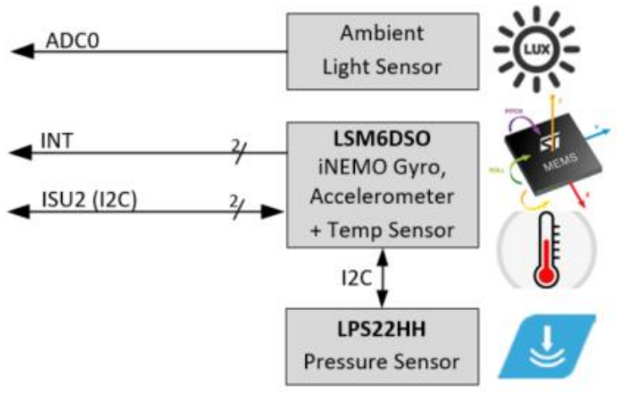
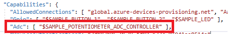
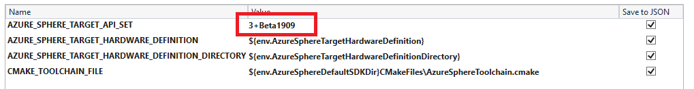
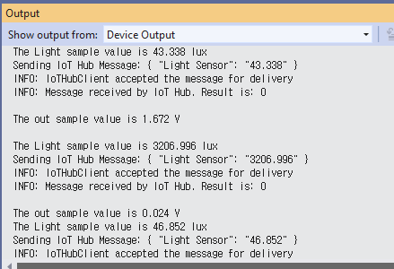

# Lab-4: 실제 데이터를 Azure IoT Hub와 Azure IoT Central과 연동하기

- [Home Page](README.md)로 돌아가기

## 목적

- Azure IoT Central 설정을 실습해봅니다.
- IoT SaaS 솔루션으로서 IoT Central 이 제공하는 기본 기능들을 이해할 수 있습니다.
- Azure Sphere 와 Azure IoT Central 을 같이 사용하여 원격데이터 수집, 시각화 그리고 원격제어를 보안의 end-to-end 솔루션으로 구현할 수 있습니다.
- [Azure Sphere Starter Kit](https://www.avnet.com/shop/us/products/avnet-engineering-services/aes-ms-mt3620-sk-g-3074457345636825680/) 의 센서로 실제 데이터를 원격에서 확인할 수 있습니다.

## 단계

1.  Azure Sphere 개발보드를 PC에 연결하고 Azure Sphere utility 에서 디바이스를 디버그 모드로 전환합니다. (OTA는 비활성화됨)
   
    `azsphere device enable-development`

2. 아래의 절차대로 Wi-Fi credential 이 설정되었는지 확인하고 Azure Sphere 를 AP에 연결합니다.

  - Wi-Fi SSID 와 패스워드를 설정하고 Azure Sphere 디바이스를 Azure Sphere 보안 서비스에 연결하도록 합니다.   
   `azsphere device wifi add --ssid <yourSSID> --psk <yourNetworkKey>`
   
   > - 보안설정이 없는 Wi-Fi 네트워크 연결에서는 --psk 플래그를 생략합니다.
   > - 만약 SSID 나 패스워드에 스페이스가 있는 경우는 " "처리 합니다. e.g. --ssid "My iPhone"

 -  아래의 커맨드로 AP에 연결되었는지 Wi-Fi 상태를 확인할 수 있습니다.
   
    `azsphere device wifi show-status`


    
    
    
   
3. [Setup IoT Central](https://docs.microsoft.com/ko-kr/azure-sphere/app-development/setup-iot-central) 페이지를 통해 cloud resource 들을 설정합니다. 주요 단계는 아래와 같습니다.

    - Azure IoT Central Application 을 추가합니다.
    - Tenant CA 인증서를 IoT Central에 업로드하고 검증절차를 마무리합니다.

4. [Azure IoT Central](https://apps.azureiotcentral.com/) 의 내 어플리케이션으로 가서 홈페이지에 있는 **Create Device Templates** 을 클릭한 후, **Custom** 을 선택하여 빈 템플릿으로 시작합니다. 사용할 이름을 입력하고 **Create** 버튼을 눌러 추가합니다. 

    
   
5. **+ New** 버튼을 누르고 **Telemetry** 를 선택합니다.
   
   1. Display Name 과 Field Name 을 **Temperature**로 합니다.
   Field Name은 샘플 코드에 있는 이름과 정확히 일치해야만 하므로 대소문자에 유의합니다. 단위는 Degrees로 하고 최소 / 최대값은 각각 -40 과 85 로 설정합니다. Save를 클릭하여 저장합니다.

   2. 같은 방법으로 **Humidity** 를 추가합니다. 범위와 단위는 각각 0% 에서 100% 로 합니다.
   
   3. 같은 방법으로 **Pressure** 를 추가합니다. 범위와 단위는 각각 300 에서 1100hPa 로 합니다.


6. **+ New** 버튼을 클릭하고 **Event**를 선택합니다. Display Name 과 Field Name 을 **ButtonPress** 로 합니다. Save를 클릭하여 저장합니다.

    

7. 창의 왼쪽에서 디바이스를 선택한 다음 **+** 를 누르고 **Real** 을 선택하여 새로운 디바이스를 추가합니다. Device ID 와 Device Name 을 묻는 대화창이 나타납니다.

    

8. Azure Sphere Developer Command Prompt에서 아래의 커맨드를 입력합니다.
   
   `powershell -Command ((azsphere device show-attached)[0] -split ': ')[1].ToLower()`

   소문자로 출력된 Device ID 를 복사하여 대화창의 Device ID 항목에 붙여넣기 합니다. Device Name은 자동으로 Device ID에 맞게 변경됩니다. **Create** 버튼을 클릭합니다.

9. Visual Studio에서 'Open a project or solution'을 클릭합니다.
`.\azure-sphere-samples\Samples\AzureIoT` 폴더를 연 후, *AzureIoT.sln* 솔루션 파일을 선택합니다. 프로젝트를 빌드하기 전에 3가지 필수 정보를 *app_manifest.json* 파일에 입력을 해줍니다.
   
   - Azure Sphere 디바이스의 Tenant ID   
   - Azure IoT Central 어플리케이션의 Scope ID   
   - Azure IoT Central 어플리케이션의 IoT Hub URL 주소

    Tenant ID 는 아래의 Azure Sphere CLI 커맨드를 통해서 얻을 수 있습니다.

    `azsphere tenant show-selected`

    

    Scope ID 와 IoT Hub URL 을 쉽게 얻을 수 있는 툴이 *.\azure-sphere-samples\Samples\AzureIoT\Tools* 폴더에 있습니다. Azure Sphere 커맨드 라인 유틸리티에서 해당 폴더로 이동한 후, `ShowIoTCentralConfig.exe`를 실행하고, 'Y'를 입력합니다. 만약 로그인 창이 뜨면 내 Credential로 로그인합니다.

    

        
    출력된 정보들을 *app_manifest.json* 파일에 아래와 같이 추가해줍니다.

    

10. Azure Sphere Starter Kit 의 센서는 아래와 같이 연결되어 있습니다.

    

11. ADC0 접근 권한을 어플리케이션에 주기위해 app_manifest.json 파일을 수정합니다. 아래와 같이 ADC 항목 안에 "$SAMPLE_POTENTIOMETER_ADC_CONTROLLER" 으로 추가합니다.
    
    

12. Beta 기능인 ADC 를 사용하기 위해서는 CMakeSettings.json 을 더블클릭하여 아래와 같이 ``3+Beta1909`` API Library set 으로 설정해주어야 합니다.

    


13. 가상 데이터를 보내는 부분을 실제 데이터로 보내도록 main.c 를 수정합니다.
    
    ```
    #include <applibs/adc.h> //추가
    ```

    ```
    //InitPeripheralsAndHandlers() 에 아래 ADC 설정 추가

    adcControllerFd = ADC_Open(SAMPLE_POTENTIOMETER_ADC_CONTROLLER);
	if (adcControllerFd < 0) {
		Log_Debug("ADC_Open failed with error: %s (%d)\n", strerror(errno), errno);
		return -1;
	}

	sampleBitCount = ADC_GetSampleBitCount(adcControllerFd, SAMPLE_POTENTIOMETER_ADC_CHANNEL);
	if (sampleBitCount == -1) {
		Log_Debug("ADC_GetSampleBitCount failed with error : %s (%d)\n", strerror(errno), errno);
		return -1;
	}
	if (sampleBitCount == 0) {
		Log_Debug("ADC_GetSampleBitCount returned sample size of 0 bits.\n");
		return -1;
	}

	int result = ADC_SetReferenceVoltage(adcControllerFd, SAMPLE_POTENTIOMETER_ADC_CHANNEL,
		sampleMaxVoltage);
	if (result < 0) {
		Log_Debug("ADC_SetReferenceVoltage failed with error : %s (%d)\n", strerror(errno), errno);
		return -1;
	}


    ```

    ```
    // AzureTimerEventHandler() 에서 수정

    if (iothubAuthenticated) {
    //SendSimulatedTemperature();
    SendSensorData();
    IoTHubDeviceClient_LL_DoWork(iothubClientHandle);
    }
    ```
    
    
    ```
    // 추가
    void SendSensorData(void)
    {
	    uint32_t value;
        int result = ADC_Poll(adcControllerFd, SAMPLE_POTENTIOMETER_ADC_CHANNEL, &value);
        if (result < -1) {
            Log_Debug("ADC_Poll failed with error: %s (%d)\n", strerror(errno), errno);
            terminationRequired = true;
            return;
        }

	// get voltage (2.5*adc_reading/4096)
	// divide by 3650 (3.65 kohm) to get current (A)
	// multiply by 1000000 to get uA
	// divide by 0.1428 to get Lux (based on fluorescent light Fig. 1 datasheet)
	// divide by 0.5 to get Lux (based on incandescent light Fig. 1 datasheet)
	// We can simplify the factors, but for demostration purpose it's OK

        float voltage = ((float)value * sampleMaxVoltage) / (float)((1 << sampleBitCount) - 1);
        float light_sensor = ((float)value * 2.5 / 4095) * 1000000 / (3650 * 0.1428);//James
        Log_Debug("The out sample value is %.3f V\n", voltage);
        Log_Debug("The Light sample value is %.3f lux\n", light_sensor);
        
        char tempBuffer[20], luxBuffer[20], pressureBuffer[20], axlBufferX[20], axlBufferY[20], axlBufferZ[20], angBufferX[20], angBufferY[20], angBufferZ[20]; 

        int len = snprintf(luxBuffer, 20, "%0.3f", light_sensor);
        if (len > 0) {
            SendTelemetry("Light Sensor", luxBuffer);
        }
    }
    ```

14. F5 를 눌러 빌드하고 어플리케이션을 실행합니다. Azure IoT Central 디바이스 대시보드로 이동하여 데이터를 확인합니다.

    

    

## 도전

> 버튼을 눌렀을 때 센서값을 보내도록 수정해봅니다.

> 다른 MEMS 센서들도 추가해봅니다. LSMDSO (6-Axis Axl. Gyro), LPS22HH(대기압) 이 경우 5번 항목에서 aX, aY, aZ, gX, gY, gZ 와 pressure 를 디바이스 템플릿의 telemetry 에 추가해줍니다.
Hint 를 참조합니다. i2cDevice.c, lps22hh_reg.c and lsm6dso_reg.c를 추가하기 위해 CMakeLists.txt 파일을 수정해야 합니다.
    


## 더 보기

- [What is Azure IoT Central](https://docs.microsoft.com/en-us/azure/iot-central/overview-iot-central)
- [Azure IoT Central Architecture](https://docs.microsoft.com/en-us/azure/iot-central/concepts-architecture)
- [Use I2C with Azure Sphere](https://docs.microsoft.com/en-us/azure-sphere/app-development/i2c)
- [Manage target hardware dependencies](https://docs.microsoft.com/en-us/azure-sphere/app-development/manage-hardware-dependencies)


