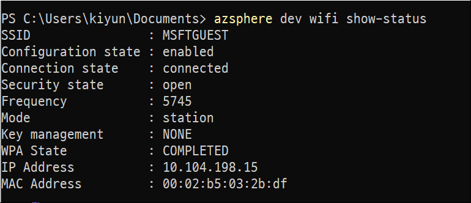
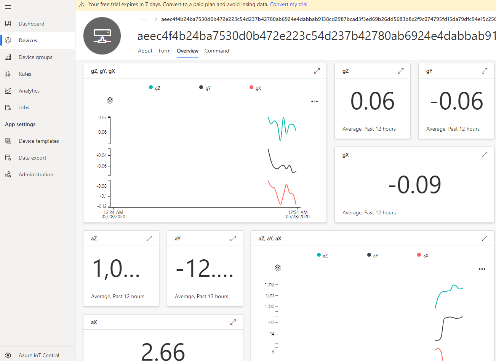

# Lab-4: 실제 데이터를 Azure IoT Hub와 Azure IoT Central과 연동하기

- [Home Page](README.md)로 돌아가기

## 목적

- Azure IoT Central 설정을 실습해봅니다.
- IoT SaaS 솔루션으로서 IoT Central 이 제공하는 기본 기능들을 이해할 수 있습니다.
- Azure Sphere 와 Azure IoT Central 을 같이 사용하여 원격데이터 수집, 시각화 그리고 원격제어를 보안의 end-to-end 솔루션으로 구현할 수 있습니다.

## 단계

1.  Azure Sphere 개발보드를 PC에 연결하고 Azure Sphere utility 에서 디바이스를 디버그 모드로 전환합니다. (OTA는 비활성화됨)
   
    `azsphere device enable-development`

2. 아래의 절차대로 Wi-Fi credential 이 설정되었는지 확인하고 Azure Sphere 를 AP에 연결합니다.

  - Wi-Fi SSID 와 패스워드를 설정하고 Azure Sphere 디바이스를 Azure Sphere 보안 서비스에 연결하도록 합니다.   
   `azsphere device wifi add --ssid <yourSSID> --psk <yourNetworkKey>`
   
   > - 보안설정이 없는 Wi-Fi 네트워크 연결에서는 --psk 플래그를 생략합니다.
   > - 만약 SSID 나 패스워드에 스페이스가 있는 경우는 " "처리 합니다. e.g. --ssid "My iPhone"

 -  아래의 커맨드로 AP에 연결되었는지 Wi-Fi 상태를 확인할 수 있습니다.
   
    `azsphere device wifi show-status`

    
    
    
   
3. [Setup IoT Central](https://docs.microsoft.com/ko-kr/azure-sphere/app-development/setup-iot-central) 페이지를 통해 cloud resource 들을 설정합니다. 주요 단계는 아래와 같습니다.

    - Azure IoT Central Application 을 추가합니다.
    - Tenant CA 인증서를 IoT Central에 업로드하고 검증절차를 마무리합니다.

4. [Azure IoT Central](https://apps.azureiotcentral.com/) 을 클릭하여 Microsoft 계정 혹은 Azure 계정으로 로그인 하고 **+New application** 을 클릭합니다.

5. [링크](https://github.com/Azure/azure-sphere-samples/blob/master/Samples/AzureIoT/IoTCentral.md#create-an-azure-iot-central-application) 로 이동하여 예제 가이드를 따릅니다. 절차는 아래와 같습니다.

   - 새로운 IoT Central Application 추가
   - 7일 무료 체험 사용
   - 기본 제공 Azure Sphere 예제 Template 선택
   - 기본 View 및 제어용 버튼 추가
   - Scope ID / IoT Central App URL / Tenant ID 를 app_manifest 에 추가
   - 예제 실행
   - IoT Central 에서 디바이스를 해당 Template 으로 Migrate
   - 온도값 / 버튼 / LED제어 / Alarm Method 확인
   

    Tenant ID 는 아래의 Azure Sphere CLI 커맨드를 통해서 얻을 수 있습니다.

    `azsphere tenant show-selected`

    

    Scope ID 와 IoT Hub URL 을 쉽게 얻을 수 있는 툴이 *.\azure-sphere-samples\Samples\AzureIoT\Tools* 폴더에 있습니다. Azure Sphere 커맨드 라인 유틸리티에서 해당 폴더로 이동한 후, `ShowIoTCentralConfig.exe`를 실행하고 위 링크의 가이드 대로 따릅니다.

    

        
    출력된 정보들을 *app_manifest.json* 파일에 아래와 같이 추가해줍니다.

    

10. 여기까지는 Lab3 과 동일한 과정입니다.

11. 이 다음은 실제 Avnet MT3620 Starter Kit 의 센서 데이터를 Azure IoT Central 로 전송하여 확인하는 과정입니다. 과정은 아래와 같습니다.

    - Git Patch 파일 적용
    - git apply 0001-....
    - git apply 0002-....
    - git diff 로 변경 확인
    - 프로젝트 cmake cache delete - generate
    - build all
    - I2C 권한 추가 / "I2cMaster": [ "$AVNET_MT3620_SK_ISU2_I2C" ]
    - 예제 실행
    - Azure IoT Central 에 새 템플릿 추가 / View 탭에서 새로운 view 작성
    - Device 를 새로운 Template 로 Migrate

12. 모든 과정이 성공하면 아래와 같이 실제 데이터를 볼 수 있습니다.

    

## 더 보기

- [What is Azure IoT Central](https://docs.microsoft.com/en-us/azure/iot-central/overview-iot-central)
- [Azure IoT Central Architecture](https://docs.microsoft.com/en-us/azure/iot-central/concepts-architecture)
- [Use I2C with Azure Sphere](https://docs.microsoft.com/en-us/azure-sphere/app-development/i2c)
- [Manage target hardware dependencies](https://docs.microsoft.com/en-us/azure-sphere/app-development/manage-hardware-dependencies)

